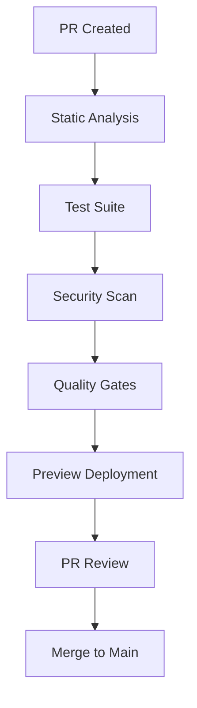
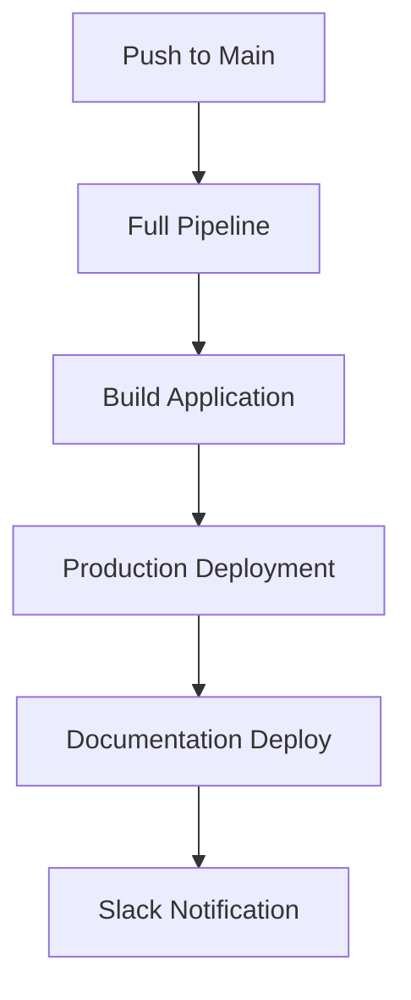

# CI/CD Workflow Configuration

This document provides an overview of the GitHub Actions workflows configured
for JERICHO's continuous integration and deployment pipeline.

## 🚀 Workflow Overview

### Primary Workflows

| Workflow                | Purpose                         | Triggers                | Key Features                               |
| ----------------------- | ------------------------------- | ----------------------- | ------------------------------------------ |
| **testing.yml**         | Test suite execution            | Push/PR to main/develop | Multi-node testing, coverage reporting     |
| **static-analysis.yml** | Code quality analysis           | Push/PR to main/develop | ESLint, TypeScript, security scans         |
| **security.yml**        | Security vulnerability scanning | Push/PR/scheduled       | Snyk, CodeQL, dependency review            |
| **deploy.yml**          | Build and deployment            | Push to main, releases  | Preview deployments, production deployment |
| **quality-gate.yml**    | Quality enforcement             | Pull requests           | Coverage thresholds, bundle size limits    |
| **docs.yml**            | Documentation management        | Docs changes            | Link checking, spell checking, deployment  |
| **dependencies.yml**    | Dependency management           | Weekly/Manual           | Automated updates, license compliance      |

## 🔧 Configuration Files

### Development Tools

- **TypeScript**: Strict type checking (`tsconfig.json`)
- **ESLint**: Comprehensive linting rules (`.eslintrc.cjs`)
- **Prettier**: Code formatting (`.prettierrc.cjs`)
- **Husky**: Git hooks for pre-commit validation
- **lint-staged**: Run linters on staged files

### Quality Assurance

- **Vitest**: Testing framework with coverage
- **bundlesize**: Monitor bundle size limits
- **cspell**: Spell checking for documentation
- **markdownlint**: Markdown formatting and structure
- **license-checker**: License compliance monitoring

## 📊 Quality Metrics

### Coverage Requirements

```json
{
  "testCoverage": "≥ 90%",
  "bundleSize": "≤ 1MB",
  "eslintErrors": 0,
  "typescriptErrors": 0
}
```

### Performance Benchmarks

```json
{
  "buildTime": "< 3 minutes",
  "testExecution": "< 2 minutes",
  "securityScan": "< 5 minutes",
  "totalPipeline": "< 10 minutes"
}
```

## 🔒 Security Configuration

### Automated Scans

- **npm audit**: Package vulnerability detection
- **Snyk**: Advanced vulnerability scanning
- **CodeQL**: GitHub's advanced code analysis
- **Semgrep**: Custom security rule scanning
- **TruffleHog**: Secret detection in code

### License Compliance

- **Allowed licenses**: MIT, Apache-2.0, BSD-2-Clause, BSD-3-Clause, ISC, 0BSD
- **Automated checking**: On every PR and scheduled runs
- **Reporting**: Detailed license reports generated

## 🚀 Deployment Strategy

### Environment Configuration

```yaml
environments:
  - name: preview
    url: https://jericho.app/preview-{PR_NUMBER}
    type: temporary
  - name: production
    url: https://jericho.app
    type: protected
```

### Deployment Process

1. **Preview**: Automatic for all PRs
2. **Production**: Manual approval required
3. **Rollback**: Automated via GitHub Actions

## 📋 Workflow Execution

### Pull Request Flow



### Main Branch Deployment



## 🔑 Required Setup

### Repository Secrets

```yaml
secrets:
  SNYK_TOKEN: 'Snyk vulnerability scanner'
  SLACK_WEBHOOK_URL: 'Deployment notifications'
  CUSTOM_DEPLOY_TOKEN: 'External hosting' # If applicable
```

### Environment Variables

```yaml
env:
  NODE_ENV: 'production'
  ACTIONS_STEP_DEBUG: false
  ACTIONS_RUNNER_DEBUG: false
```

## 📈 Monitoring & Reporting

### Artifacts Generated

- **Test Results**: JSON and JUnit format
- **Coverage Reports**: HTML and JSON
- **Security Reports**: Detailed vulnerability analysis
- **Quality Metrics**: Performance and complexity analysis
- **Build Artifacts**: Distribution files

### Notifications

- **Pull Request**: Automated comments with quality metrics
- **Slack**: Deployment status notifications
- **GitHub**: Status checks and environment updates

## 🛠️ Local Development

### Pre-commit Hooks

```bash
# Install hooks
npm run prepare

# Manual hook execution
npx lint-staged

# Full quality check locally
npm run check-all
```

### Workflow Testing

```bash
# Install Act for local GitHub Actions
brew install act

# Run all workflows locally
act

# Run specific workflow
act -j test
act -j static-analysis
```

## 🔍 Troubleshooting

### Common Issues

#### Build Failures

```bash
# Clear all caches
rm -rf node_modules package-lock.json
npm install

# Check TypeScript compilation
npx tsc --noEmit

# Run specific failing test
npm test -- --grep "test name"
```

#### Quality Gate Failures

```bash
# Check coverage
npm run test:coverage

# Check bundle size
npm run build
npm run bundlesize

# Run linting with fix
npm run lint:fix
```

#### Security Scan Issues

```bash
# Check vulnerabilities
npm audit --json

# Fix moderate issues
npm audit fix

# Update specific package
npm update package-name
```

### Debug Mode

Enable debug logging in workflows:

```yaml
env:
  ACTIONS_STEP_DEBUG: true
  ACTIONS_RUNNER_DEBUG: true
```

## 📚 Best Practices

### Workflow Design

- ✅ **Fail Fast**: Quality checks run first
- ✅ **Parallel Execution**: Independent jobs run concurrently
- ✅ **Cached Dependencies**: Faster build times
- ✅ **Artifact Retention**: 30-90 day retention policies
- ✅ **Idempotent**: Workflows can be safely re-run

### Code Quality

- ✅ **Pre-commit Hooks**: Catch issues early
- ✅ **Automated Formatting**: Consistent code style
- ✅ **Type Safety**: Strict TypeScript configuration
- ✅ **Test Coverage**: Minimum 90% coverage requirement
- ✅ **Performance Monitoring**: Bundle size and build time limits

### Security

- ✅ **Regular Scanning**: Weekly automated security checks
- ✅ **Dependency Updates**: Automated security patching
- ✅ **Secret Detection**: Prevent credential leakage
- ✅ **License Compliance**: Monitor package licenses
- ✅ **Access Control**: Protected production deployments

This CI/CD configuration ensures high-quality, secure, and reliable deployment
of the JERICHO application. 🎯
